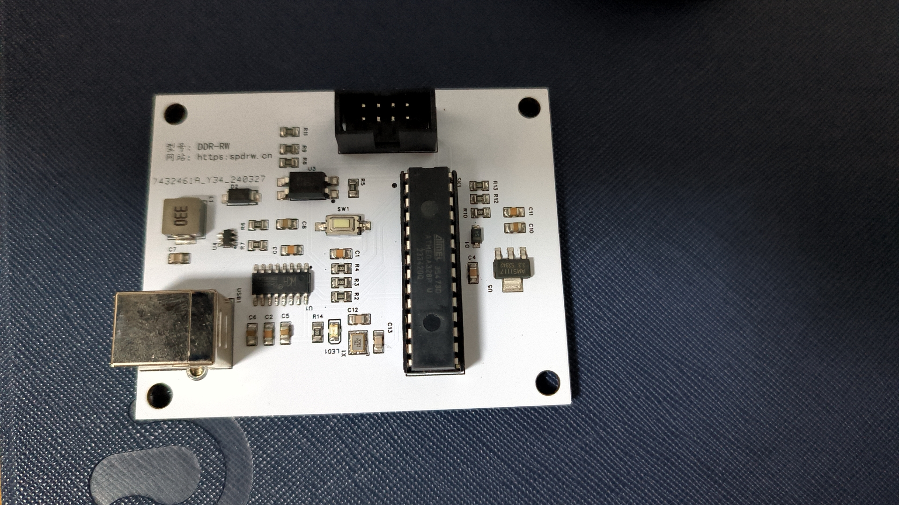

# SPDRW

根据开源项目 https://github.com/1a2m3/SPD-Reader-Writer 做的配套硬件；利用Arduino对I2C总线进行读写，一块主控板搭配不同的DIMM支持所有的DDR内存。

## 内存支持：

 - DDR
 - DDR2
 - DDR3
 - DDR4
 - DDR5

## 功能支持：

 - SPD读取并支持保存为bin文件。
 - SPD写入，支持写入bin、spd、thp文件。
 - 设置写保护，防止数据篡改。
 - 解除写保护，写入自定义配置，进行超频。

## 实物照片

